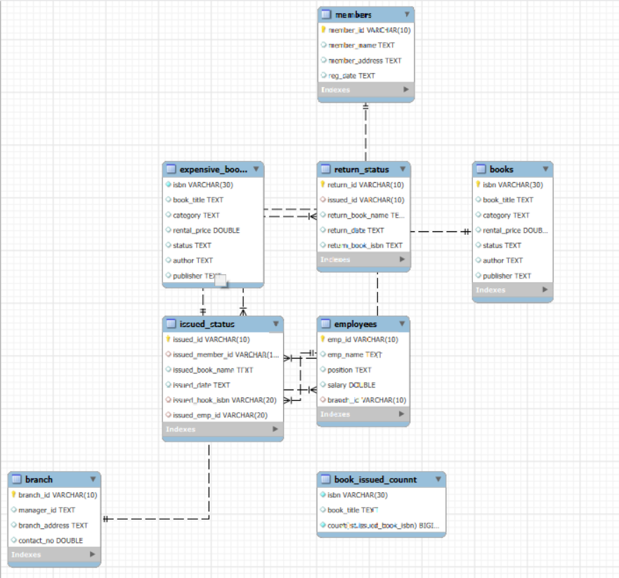

# Library Management System - README

## Project Overview
The **Library Management System** is designed to efficiently manage book records, members, employees, branches, and issued/returned books. The system is built using MySQL and includes CRUD operations, foreign key constraints, and analytical queries.

## Database Schema
The database schema consists of the following tables:
1. **books** - Stores book details.
2. **branch** - Stores library branch details.
3. **employees** - Stores employee details.
4. **members** - Stores library members' information.
5. **issued_status** - Tracks book issues.
6. **return_status** - Tracks book returns.
7. **book_issued_count** - Stores the count of books issued per book.
8. **expensive_books** - Stores books with rental prices above a certain threshold.

### Entity Relationship Diagram (ERD)
The ERD of this project is shown below:




---

## Database Creation
```sql
CREATE DATABASE library;
USE library;
```

## Importing Tables
Tables such as `books`, `branch`, `employees`, `members`, `issued_status`, and `return_status` were imported using the **MySQL Workbench Import Wizard**.

## Modifying Tables & Adding Primary Keys
```sql
ALTER TABLE books MODIFY isbn VARCHAR(30);
ALTER TABLE books ADD PRIMARY KEY(isbn);

ALTER TABLE branch MODIFY branch_id VARCHAR(10);
ALTER TABLE branch ADD PRIMARY KEY(branch_id);

ALTER TABLE employees MODIFY emp_id VARCHAR(10);
ALTER TABLE employees MODIFY branch_id VARCHAR(10);
ALTER TABLE employees ADD PRIMARY KEY(emp_id);

ALTER TABLE members MODIFY member_id VARCHAR(10);
ALTER TABLE members ADD PRIMARY KEY(member_id);

ALTER TABLE issued_status MODIFY issued_member_id VARCHAR(10);
ALTER TABLE issued_status MODIFY issued_id VARCHAR(10);
ALTER TABLE issued_status MODIFY issued_book_isbn VARCHAR(20);
ALTER TABLE issued_status MODIFY issued_emp_id VARCHAR(20);
ALTER TABLE issued_status ADD PRIMARY KEY(issued_id);

ALTER TABLE return_status MODIFY return_id VARCHAR(10);
ALTER TABLE return_status MODIFY issued_id VARCHAR(10);
ALTER TABLE return_status ADD PRIMARY KEY(return_id);
```

## Adding Foreign Keys
```sql
ALTER TABLE issued_status ADD CONSTRAINT fk_members FOREIGN KEY(issued_member_id) REFERENCES members(member_id);
ALTER TABLE issued_status ADD CONSTRAINT fk_books FOREIGN KEY(issued_book_isbn) REFERENCES books(isbn);
ALTER TABLE employees ADD CONSTRAINT fk_branch FOREIGN KEY(branch_id) REFERENCES branch(branch_id);
ALTER TABLE return_status ADD CONSTRAINT fk_issued_ID FOREIGN KEY(issued_id) REFERENCES issued_status(issued_id);
```

## CRUD Operations
### 1. Create a New Book Record
```sql
INSERT INTO books(isbn, book_title, category, rental_price, status, author, publisher)
VALUES ('978-1-60129-456-2', 'To Kill a Mockingbird', 'Classic', 6.00, 'yes', 'Harper Lee', 'J.B. Lippincott & Co.');
```

### 2. Update an Existing Member's Address
```sql
UPDATE members SET member_address = '132 Main St' WHERE member_id = 'C101';
```

### 3. Delete a Record from Issued Status Table
```sql
DELETE FROM issued_status WHERE issued_id = 'IS121';
```

### 4. Retrieve All Books Issued by a Specific Employee
```sql
SELECT * FROM issued_status WHERE issued_emp_id = 'E101';
```

### 5. List Members Who Have Issued More Than One Book
```sql
SELECT issued_emp_id, COUNT(*) FROM issued_status GROUP BY issued_emp_id HAVING COUNT(*) > 1;
```

## Analytical Queries
### 6. Create Summary Table for Issued Books Count
```sql
CREATE TABLE book_issued_count AS (
    SELECT b.isbn, b.book_title, COUNT(ist.issued_book_isbn) AS total_issued
    FROM books AS b
    JOIN issued_status AS ist ON b.isbn = ist.issued_book_isbn
    GROUP BY b.isbn, b.book_title
);
```

### 7. Retrieve Books in a Specific Category
```sql
SELECT * FROM books WHERE category = 'Classic';
```

### 8. Calculate Total Rental Income by Category
```sql
SELECT b.category, SUM(b.rental_price) AS total_income, COUNT(*) AS total_issued
FROM books AS b
JOIN issued_status AS ist ON b.isbn = ist.issued_book_isbn
GROUP BY b.category;
```

### 9. List Members Registered in the Last 180 Days
```sql
SELECT * FROM members WHERE reg_date >= CURRENT_DATE - INTERVAL 180 DAY;
```

### 10. List Employees with Their Branch Manager's Name
```sql
SELECT emp.*, b.manager_id, emp2.emp_name AS manager
FROM branch AS b
JOIN employees AS emp ON b.branch_id = emp.branch_id
JOIN employees AS emp2 ON b.manager_id = emp2.emp_id;
```

### 11. Create a Table of Expensive Books
```sql
CREATE TABLE expensive_books AS (
    SELECT * FROM books WHERE rental_price > 5
);
```

### 12. Retrieve Books Not Yet Returned
```sql
SELECT * FROM issued_status AS ist
LEFT JOIN return_status AS rts
ON ist.issued_id = rts.issued_id
WHERE return_date IS NULL;
```

---
## Summary
This **Library Management System** efficiently tracks books, employees, members, and transactions (issued and returned books). The ERD provides a visual representation of the relationships between entities. This system supports various CRUD and analytical operations, helping library administrators manage their inventory and operations effectively.

For further modifications, you can extend the system with additional features such as **fine calculation**, **book reservations**, or **automated notifications**.

---


---
**End of README**

